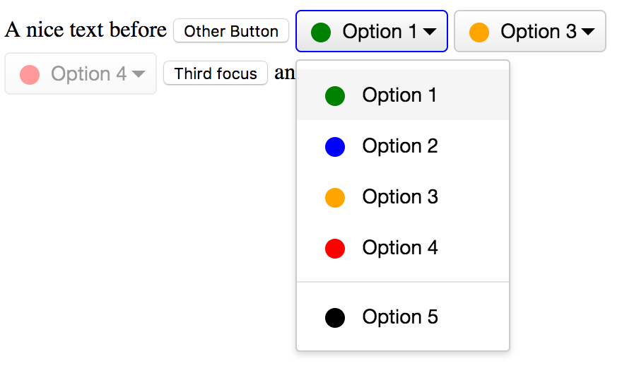

# Dropdown Component 😸

## Info
An independent HTML Dropdown component.

This component does not require JavaScript to show off, but once the end user has to select a value, JavaScript is required.

Demo: http://static.tujo.no/dropdown/index.html



## How to include it?

1) Make sure You include the ./dropdown.js and ./dropdown.css file in You HTML Document.

```html
<head>
    <link rel="stylesheet" type="text/css" href="./dropdown.css">
</head>
<body>
    <!-- Optional  -->
    <script src="./dropdown.js"></script>
</body>
```

2) Then You have to define the component content.

```html
<span class="[YOUR_POINTER] th-dropdown">
    <!-- If needed, define the default value by setting someting in the value attribute like "value="option-1"" -->
    <input value="option-1" />

    <!-- Your custom content. It is possible to wrap the ul element in an label elemnt, then the menu gets unselected also without js -->
    <ul>
      <li data-value="option-1">Option 1</li>
      ...
    </ul>

</span>
```

3) Finally, bind the optional JavaScript Component Class

```javascript
document.addEventListener('DOMContentLoaded', function(event) {

    //init the Component
    var MyComponent = new THDropdown('span.[YOUR_POINTER]');

    //get the selected value
    var value = MyComponent.getValue();

    //or listen on changes
    MyComponent.onOptionChange(function(value, content) {
        //do something
    });

});
```


## Author
Tobias Høegh, tobias@tujo.no, *2017*
